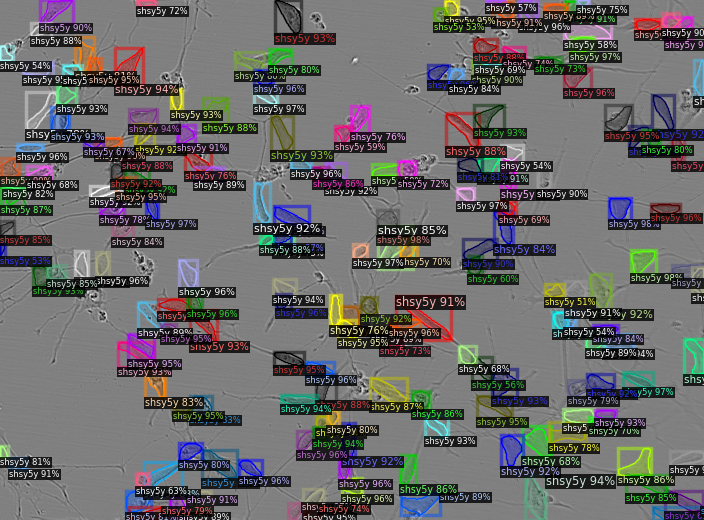

Source code of the 7th place solution (gold medal) for [Sartorius - Cell Instance Segmentation](https://www.kaggle.com/c/sartorius-cell-instance-segmentation/leaderboard) from team Train4Ever.


# 1. About the challenge
- The goal of Sartorius - Cell Instance Segmentation challenge on Kaggle is to segment individual neuronal cells in microscopic images. 
- Note that we need to distinguish among different cells as separated instances, you can refer to [this link](https://serengetitech.com/tech/deep-learning-instance-segmentation/) if not familiar with instance segmentation task. This is fundamentally different from semantic segmentation where only a binary mask is predicted to mark whether a pixel belongs to a foreground class or background. 


# 2. Solution overview
Detail explanation can be found in this Kaggle discussion: https://www.kaggle.com/c/sartorius-cell-instance-segmentation/discussion/298002


The ensembling technique used to combine 2 final segmentation model was conducted as this flow:


# 3. How to run the code
We have tried many different models such as PointRend, MaskRCNN Swin Transformer, CellPose, GCNet, etc. However the final solution is the ensembling prediction of 2 MaskRCNN ResNeSt200 model, followed by a 2nd-level catboost post-processing model. Thus, to keep everything simple, we only provide the training, evaluation and inference code of MaskRCNN ResNeSt200 and the 2nd-level catboost model.

For a quick demo on colab: https://colab.research.google.com/drive/1X2gI5jW5CrjY_gH3Cp5-oTG9c8pY47Tt?usp=sharing

## 3.1. Install dependecies
````
    bash install_libs.sh
```` 
## 3.2. Download pretrained models
````
    bash download_models.sh
````
## 3.3. Download data
````
    bash download_data.sh
````
## 3.4. Run end-to-end inference on an image
````
    python src/infer_cis.py --image [path to image] \
                            --weights [path to weights separated by space, enclosed in quote marks] \
                            --2nd_level_model [path to 2nd-level model saved in pickle file] \
                            --2nd_level_features [path to 2nd-level features saved in csv file] \
    
    Default: python src/infer_cis.py --image demo_images/7ae19de7bc2a.png \
                                    --weights 'models/pretrained_models/pseudo_round1_model.pth models/pretrained_models/pseudo_round2_model.pth' \
                                    --2nd_level_model 2nd_level_model/catboost.pkl \
                                    --2nd 2nd_level_features 2nd_level_model/features.csv
````
Output image will be saved in demo_outputs/ folder. It should look like this:



## 3.5. Train instance segmentation models
````
    python src/train_cis.py --image_dir [path to folder containing training images] \
                            --batch_size [training batch size] \
                            --annotation_dir [path to folder containing json annotations] \
                            --out_dir [path to output folder where trained weights will be saved]
````

Round-1 pseudo training:
````
    python src/train_cis.py --image_dir data/images \
                            --batch_size 1 \
                            --annotation_dir data/annotations_semi_supervised_round1 \
                            --out_dir models/maskrcnn_ResNeSt200_pseudo_round1_fold0 
````

Round-2 pseudo training:
````
    python src/train_cis.py --image_dir data/images \
                            --batch_size 1 \
                            --annotation_dir data/annotations_semi_supervised_round2 \
                            --out_dir models/maskrcnn_ResNeSt200_pseudo_round2_fold0 
````
## 3.6. Evaluate single segmentation model
````
    python src/evaluate_single_model.py --image_dir [path to folder containing validation images] \
                                        --annotation_dir [path to folder containing json annotations] \
                                        --weight [path to trained weight pth file]

    Default: python src/evaluate_single_model.py --image_dir data/images \
                                                --annotation_dir data/annotations_semi_supervised_round2 \
                                                --weight models/pretrained_models/pseudo_round2_model.pth
````
## 3.7. Evaluate model ensembling
````
    python src/evaluate_ensemble.py --image_dir [path to folder containing validation images] \
                                    --annotation_dir [path to folder containing json annotations] \
                                    --weights [path to weights separated by space, enclosed in quote marks]

    Default: python src/evaluate_ensemble.py --image_dir data/images \
                                            --annotation_dir data/annotations_semi_supervised_round2 \
                                            --weight 'models/pretrained_models/pseudo_round1_model.pth models/pretrained_models/pseudo_round2_model.pth'
````
## 3.8. Training second 2nd-level model (catboost):
### 3.8.1. Generate predicted instances on validation set:
````
    python src/prepare_for_2nd_level_model.py --image_dir [path to folder containing validation images] \
                                            --annotation_dir [path to folder containing json annotations] \
                                            --weights [path to weights separated by space, enclosed in quote marks]

    Default: python src/prepare_for_2nd_level_model.py \
                    --image_dir data/images \
                    --annotation_dir data/annotations_semi_supervised_round2 \
                    --weights 'models/pretrained_models/pseudo_round1_model.pth models/pretrained_models/pseudo_round2_model.pth'
````
Pickle output files will be saved inside folder: data_for_2nd_level_model/
### 3.8.1. Train catboost model
````
    python src/train_2nd_level_catboost.py
````
Trained catboost model and engineered features are saved inside folder: 2nd_level_model/